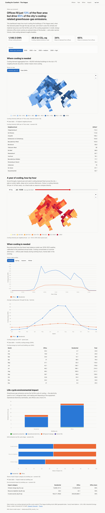
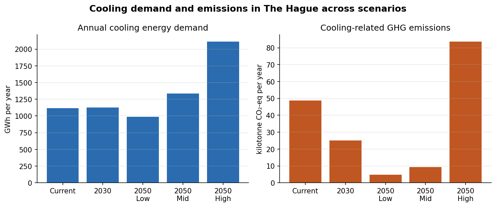
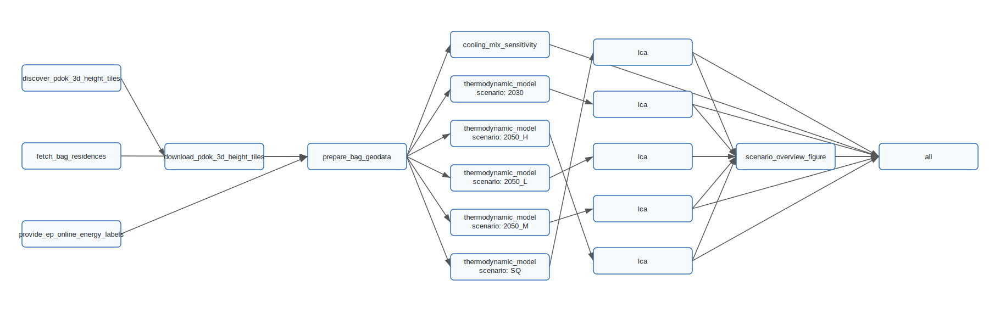

# Cooling for Comfort, Warming the World

**Residential and office cooling and its environmental impacts in The Hague, the Netherlands.**

[](https://github.com/simonvanlierde/msc-thesis-ie/actions/workflows/ci.yml)
[](https://simonvanlierde.github.io/msc-thesis-ie/)
[](https://www.python.org/)
[](LICENSE)
[](https://doi.org/10.5281/zenodo.8344580)
[](https://repository.tudelft.nl/record/uuid:32222863-536f-464a-b8c6-6c2283a7249a)

The model behind my MSc Industrial Ecology thesis (Leiden University & TU Delft). It estimates
how much cooling the building stock of The Hague needs, and what that cooling costs in
electricity, greenhouse-gas emissions and material use — today and under 2030 and 2050 scenarios.

## Interactive dashboard

**[Open the live dashboard →](https://simonvanlierde.github.io/msc-thesis-ie/)**

[](https://simonvanlierde.github.io/msc-thesis-ie/)

A choropleth of cooling demand across The Hague, the diurnal and seasonal demand profile, and the
life-cycle impact breakdown, with a plain-language summary for non-experts. It runs on real model
output.

```bash
cd dashboard && pnpm install && pnpm dev
```

See [`dashboard/README.md`](dashboard/README.md) for the data-build steps, accessibility notes and
the GitHub Pages deployment.

## Key findings



- Offices occupy only **13%** of the floor area but account for **34%** of current cooling demand
  and **65%** of cooling-related greenhouse-gas emissions.
- Cooling already represents about **25%** of office electricity use, against **5.5%** for
  residential buildings.
- An estimated **77%** of cooling demand is currently unmet, and that gap falls hardest on
  economically disadvantaged neighbourhoods.
- Under a business-as-usual 2050 scenario, cooling energy demand roughly **doubles** relative to
  today, putting pressure on the Netherlands' 2050 net-zero target.

The full method and discussion are in the
[thesis](https://repository.tudelft.nl/record/uuid:32222863-536f-464a-b8c6-6c2283a7249a).

## How the model works

1. **Geospatial data** — building footprints and attributes from the Dutch BAG (*Basisregistratie
   Adressen en Gebouwen*), processed into building archetypes.
2. **Thermodynamic modelling** — an hourly heat-balance model (transmission, infiltration,
   ventilation, solar gains and internal loads) driven by KNMI weather data, giving cooling energy
   and peak power demand per building.
3. **Environmental impact assessment** — life-cycle-based impacts (climate change, abiotic resource
   depletion, crustal scarcity) from both the operational energy and the cooling equipment itself.

## Getting started

The large spatial input datasets live on Zenodo
([10.5281/zenodo.8344580](https://doi.org/10.5281/zenodo.8344580)), not in this repository. The
Snakemake pipeline can also fetch them from the official PDOK APIs.

With [uv](https://docs.astral.sh/uv/) (recommended):

```bash
git clone https://github.com/simonvanlierde/msc-thesis-ie.git
cd msc-thesis-ie
uv sync                 # locked environment from uv.lock
uv run jupyter lab      # open main.ipynb and gis.ipynb
```

<details>
<summary>With pip</summary>

```bash
git clone https://github.com/simonvanlierde/msc-thesis-ie.git
cd msc-thesis-ie
python -m venv .venv && source .venv/bin/activate
pip install .
jupyter lab
```

</details>

## Repository structure

| Path | Description |
| --- | --- |
| `cdm/` | The model package (see below). |
| `main.ipynb` | End-to-end notebook: cooling demand, environmental impacts, sensitivity analysis, result figures. |
| `gis.ipynb` | Preparation of the BAG geospatial data and spatial visualisations. |
| `Snakefile`, `config/` | The reproducible pipeline and its city / weather configuration. |
| `data/input/parameters/` | All model input parameters, organised per scenario. |
| `data/output/` | Committed reference results per building type and energy label. |
| `dashboard/` | The interactive web dashboard. |
| `scripts/` | Data acquisition and pipeline entry points. |
| `docs/` | The headline figure and the script that regenerates it. |
| `tests/` | Unit tests for the geometric, thermodynamic and environmental functions. |

Inside `cdm/`:

| Module | Role |
| --- | --- |
| `readers.py` | Reading, joining and preparing the building data. |
| `parameters.py`, `constants.py` | Scenario parameters and physical constants. |
| `geometric.py` | Building geometry: facade orientation, window and wall areas. |
| `thermodynamic.py` | The hourly heat-balance and cooling-demand calculations. |
| `environmental.py` | Life-cycle environmental impacts of cooling. |
| `time_series.py` | KNMI weather retrieval and time-series construction. |
| `aggregation.py` | Aggregation of building-level results. |
| `sensitivity_analysis.py` | Scenario and one-at-a-time sensitivity analysis. |
| `figures.py`, `figures_sensitivity.py` | Plotting helpers for the result figures. |

## Reproducible pipeline

The notebook analysis is also declared as a [Snakemake](https://snakemake.readthedocs.io/) workflow.
It wraps the same `cdm/` model code — it does not reimplement the science.



```bash
uv sync                                                  # once
uv run snakemake --cores 4                               # scenario results + overview figure
uv run snakemake --configfile config/smoke.yaml --cores 4  # fast end-to-end check (minutes)
```

Or run it hermetically in a container:

```bash
docker build -t cooling-demand .
docker run --rm -e EP_ONLINE_API_KEY -v "$PWD:/work" cooling-demand snakemake --cores 4
```

Everything the pipeline generates goes under `results/` (configurable via `results_dir` in
`config/sources.yaml`), leaving the committed reference results in `data/output/` and `docs/`
untouched — so a run is safe to repeat, and you can check reproduction directly:

```bash
diff results/CDM_results_SQ_full.csv data/output/CDM_results_SQ_full.csv
```

`results/` and the fetched `data/raw/` inputs are git-ignored. Each rule writes a log under
`results/logs/`, and the model stages a runtime benchmark under `results/benchmarks/`.

### Opt-in targets

These are kept out of the default `all` target because they are heavy:

```bash
# Cooling-technology-mix sensitivity: 30 ordered technology pairs × a 20-step mix sweep,
# each running the full model over the building stock. Lower --calculation-steps for a
# faster, coarser table.
uv run snakemake --cores 4 cooling_mix

# Clip the RIVM urban-heat-island raster to the city (downloads a ~1.95 GB national ZIP once).
uv run snakemake --cores 4 data/input/geodata/UHI_effect_TheHague.tif

# Execute the analysis notebooks headless, keeping the executed copies as artifacts. gis needs
# the UHI raster above; main needs a sample subset or ample RAM (its figures keep the full hourly
# time series in memory).
uv run snakemake --cores 4 notebooks
```

### Configuring the city and weather window

Both are declared in `config/sources.yaml`:

```yaml
city:
  name: "'s-Gravenhage" # official municipality name (fetched from PDOK)
  weather_station: 330 # nearest KNMI station
weather:
  start_year: 2018
  end_year: 2022
```

The municipal boundary and bounding box are fetched from PDOK by name, so switching cities is just a
name change plus the nearest KNMI station. Buildings are clipped to the boundary, so results cover
exactly that municipality. To override without editing the file:

```bash
uv run snakemake --config city='{name: Rotterdam, weather_station: 344}' --cores 4
```

### EP-Online energy labels

`provide_ep_online_energy_labels` downloads the full public label export via the EP-Online v5 API.
Request a key at <https://www.ep-online.nl/PublicData> and put it in a `.env` file at the repo root:

```bash
EP_ONLINE_API_KEY=your-key-here
```

The rule resolves the signed download URL, streams the ZIP, and extracts the CSV to
`data/raw/ep_online/current/energy_labels.csv` (~1.5 GB uncompressed). It skips the download when a
valid file is already present. The key is read from the environment or `.env` and is never
committed.

<details>
<summary>Pipeline stages</summary>

| Rule | Existing analysis step | Main inputs | Main outputs |
| --- | --- | --- | --- |
| `fetch_city_boundary` | Municipal extent by name | PDOK Bestuurlijke gebieden OGC API `gemeentegebied` | city boundary GeoJSON + CRS84 bbox |
| `fetch_bag_residences` | Official BAG residence/use acquisition | PDOK BAG OGC API `verblijfsobject`, city bbox | `data/raw/pdok_bag/verblijfsobject_{city}.gpkg` |
| `discover_pdok_3d_height_tiles` | Height-tile discovery | PDOK 3D Basisvoorziening OGC API `hoogtestatistieken_gebouwen`, city bbox | height-tile manifest |
| `download_pdok_3d_height_tiles` | Official height geodata acquisition | PDOK 3D Basisvoorziening tile download links | local GeoPackage ZIP tiles and manifest |
| `provide_ep_online_energy_labels` | Credentialed energy-label source boundary | EP-Online public export | `data/raw/ep_online/current/energy_labels.csv` |
| `fetch_weather` | KNMI weather-series retrieval | KNMI hourly API (station + year window), committed backup fallback | `results/weather/knmi_{station}_{start}_{end}.csv` |
| `prepare_bag_geodata` | Scripted replacement for the BAG/geodata joins in `gis.ipynb` | PDOK BAG residences, PDOK 3D height tiles, EP-Online labels, city boundary (clip) | `results/geodata/BAG_buildings_with_residence_data_full.gpkg` |
| `thermodynamic_model` | cooling-demand model from `main.ipynb` | processed BAG geodata, `parameters.toml` (per scenario), weather CSV, load-factor inputs | `results/intermediate/buildings_with_cooling_demand_{scenario}_full.gpkg` |
| `lca` | environmental-impact and aggregation steps from `main.ipynb` | cooling-demand geodata and scenario parameters | `results/CDM_results_{scenario}_full.csv` and CDM geodata |
| `scenario_overview_figure` | README headline figure script | scenario result CSVs | `results/figures/scenario_overview.png` |
| `cooling_mix_sensitivity` (opt-in) | cooling-technology-mix sensitivity cells in `main.ipynb`, extracted to `scripts/run_cooling_mix_sensitivity.py` | processed BAG geodata, SQ parameters, weather CSV | `results/cooling_mix_elasticities_table.csv` |
| `fetch_uhi_raster` (opt-in) | RIVM urban-heat-island raster, previously a manual download | national UHI ZIP (RIVM), city bbox | `data/input/geodata/UHI_effect_TheHague.tif` (clipped) |
| `run_main_notebook` / `run_gis_notebook` (opt-in) | execute the analysis notebooks headless; keep the executed copy | pipeline outputs the notebook reads, `cdm/`, the notebook | `results/notebooks/{main,gis}.executed.ipynb` |

PDOK data is licensed under Public Domain Mark 1.0 (BAG, boundaries) and CC BY 4.0 (3D
Basisvoorziening). PDOK 3D height-attribute column names were verified against a 2025
`hoogtestatistieken_gebouwen` tile (`identificatie`, `status`, `oorspronkelijkbouwjaar`,
`rf_h_ground`, `rf_h_roof_70p`). If a future vintage changes the schema,
`scripts/gis/prepare_pdok_model_geodata.py` fails loudly listing the available columns instead of
guessing.

</details>

## Development

The project uses the [Astral](https://astral.sh/) toolchain:

```bash
uv run ruff check .            # lint
uv run ruff format .           # format
uv run ty check                # type check (informational)
uv run pytest                  # tests
```

The same checks run in CI on every push and pull request
([workflow](.github/workflows/ci.yml)), and locally on every commit once the hook is installed:

```bash
uv run pre-commit install
```

The hook runs ruff (lint + format), the test suite, and `ty` — the latter reports its findings
without blocking, as in CI.

Regenerating the committed figure and DAG:

```bash
uv run python docs/make_overview_figure.py

# Reproduces the committed SVG (no Graphviz binary required)
uv run snakemake --dag | uv run python scripts/dot_to_simple_svg.py > docs/pipeline_dag.svg
```

## Citation

If you use this work, please cite the thesis and dataset (see [`CITATION.cff`](CITATION.cff)):

> van Lierde, S. (2024). *Cooling for Comfort, Warming the World: Residential and Office Cooling and
> its Environmental Implications in The Hague.* MSc thesis, Industrial Ecology, Leiden University &
> TU Delft.

## Acknowledgements

Supervised by Prof. ir. Peter Luscuere and Dr. Benjamin Sprecher.

## License

Released under the [GNU General Public License v3.0](LICENSE).
